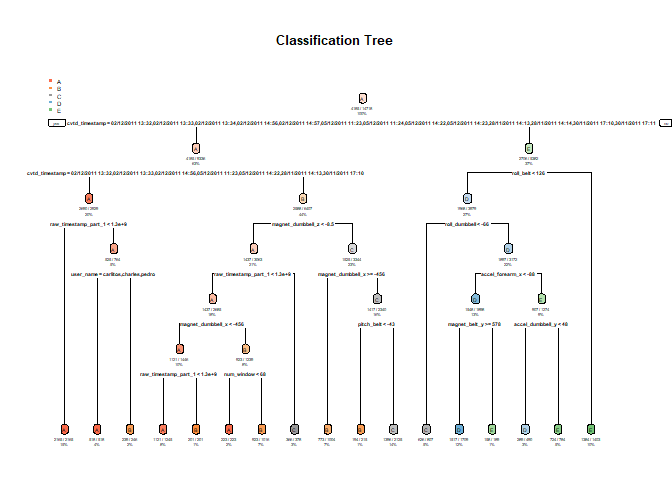

Predicting the effectiveness of Physical Activities performed(like lifting,etc.) using data collected from accelerometers
=========================================================================================================================

Background
----------

It is now possible to collect a large amount of data about personal activity Using devices such as Jawbone Up, Nike FuelBand, and Fitbit. These type of devices are part of the quantified self movement - a group of enthusiasts who take measurements about themselves regularly to improve their health, to find patterns in their behavior, or because they are tech geeks. One thing that people regularly do is quantify how much of a particular activity they do, but they rarely quantify how well they do it.

In this project, your goal will be to use data from accelerometers on the belt, forearm, arm, and dumbell of 6 participants. They were asked to perform barbell lifts correctly and incorrectly in 5 different ways. More information is available from the website here: <http://web.archive.org/web/20161224072740/http:/groupware.les.inf.puc-rio.br/har> (see the section on the Weight Lifting Exercise Dataset).

Data
----

### The training data for this project are available here:

<https://d396qusza40orc.cloudfront.net/predmachlearn/pml-training.csv>

### The test data are available here:

<https://d396qusza40orc.cloudfront.net/predmachlearn/pml-testing.csv>

Brief Description of Data
-------------------------

*as from the HAR Dataset from the paper "Velloso, E.; Bulling, A.; Gellersen, H.; Ugulino, W.; Fuks, H. Qualitative Activity Recognition of Weight Lifting Exercises. Proceedings of 4th International Conference in Cooperation with SIGCHI (Augmented Human '13) . Stuttgart, Germany: ACM SIGCHI, 2013."*

The outcome variable *classe*, is a factor with 5 levels. Six young health participants were asked to perform one set of 10 repetitions of the Unilateral Dumbbell Biceps Curl in five different fashions:

*Class A*=exactly according to the specification

*Class B*=throwing the elbows to the front

*Class C*=lifting the dumbbell only halfway

*Class D*=lowering the dumbbell only halfway

*Class E*=throwing the hips to the front

Class A corresponds to the specified execution of the exercise, while the other 4 classes correspond to common mistakes."

Cross-validation
----------------

Performed by subsampling training data set randomly without replacement into 2 subsamples: subTraining data (75% of the original Training data set) and subTesting data (25%). The Models are fitted on the subTraining data set, and tested on the subTesting data. The most accurate model used to test the original Testing data set.

Expected out-of-sample error
----------------------------

outcome variable "classe" is an unordered factor variable. Thus, we can choose our error type as Accuracy

The expected out-of-sample error is judged by accuracy in the cross-validation data.

Accuracy= (correct classified observation / total sample in the subTesting data set)x100%.

Out-of-sample error=No.of missclassified observations/total observations in the Test data set

As sample size is large sample N= 19622 in the Training data set. Thus it can be split into *subTraining* and *subTesting* to allow cross-validation.

Prediction Philosophy
---------------------

Decision tree and random forest algorithms will be used to do the prediction as these are known for their ability to classify data as per relevance.Prediction evaluations will be based on maximizing the accuracy and minimizing the out-of-sample error. Missing values will be discarded before prediction.The model with the highest accuracy will be chosen as our final model.

Codes and Report
================

Loading of required Libraries an packages and Setting Seed
----------------------------------------------------------

``` r
library(caret)
```

    ## Loading required package: lattice

    ## Loading required package: ggplot2

``` r
library(randomForest)
```

    ## randomForest 4.6-12

    ## Type rfNews() to see new features/changes/bug fixes.

    ## 
    ## Attaching package: 'randomForest'

    ## The following object is masked from 'package:ggplot2':
    ## 
    ##     margin

``` r
library(rpart) 
library(rpart.plot)
library(RColorBrewer)
library(rattle) 
```

    ## Rattle: A free graphical interface for data science with R.
    ## Version 5.1.0 Copyright (c) 2006-2017 Togaware Pty Ltd.
    ## Type 'rattle()' to shake, rattle, and roll your data.

    ## 
    ## Attaching package: 'rattle'

    ## The following object is masked from 'package:randomForest':
    ## 
    ##     importance

``` r
set.seed(1234)
```

Data Loading
------------

``` r
if (file.exists("pml-training.csv")) {
        training <- read.csv("pml-training.csv", na.strings=c("NA","#DIV/0!",""))
}else { 
        training <- read.csv("https://d396qusza40orc.cloudfront.net/predmachlearn/pml-training.csv",na.strings=c("NA","#DIV/0!",""))
        }                           

 

if (file.exists("pml-testing.csv")) {
        testing <- read.csv("pml-testing.csv", na.strings=c("NA","#DIV/0!",""))
} else { 
       testing <- read.csv("https://d396qusza40orc.cloudfront.net/predmachlearn/pml-testing.csv",na.strings=c("NA","#DIV/0!",""))
}   
```

Data Cleaning
-------------

Removing the columns majority NA values and also with Near Zero variance in values.

``` r
##the variance pattern of all the columns including those near Zero variance or not near Zero variance are as below
DataNZV <- nearZeroVar(training, saveMetrics=TRUE)
##Segregate the ones with only near Zero variance value
DataNZV<-DataNZV[(DataNZV$nzv==TRUE),]
##near Zero variance columns are as below
RemoveCols<-c(rownames(DataNZV))
##removing the near Zero variance values from the training dataset
training<-training[,!(names(training) %in% RemoveCols)]


##calculating % of NAs in each column
maxNA<-sapply(training, function(x) (sum(is.na(x))/length(x))*100)
maxNA<-data.frame(maxNA)
maxNA<-data.frame(VarName=rownames(maxNA),NAVals=maxNA$maxNA)
maxNA<-maxNA[maxNA$NAVals<=60,]
training<-training[,names(training)%in%maxNA$VarName]

##Removing the Serial No Column X or the first Column
training<-training[,-1]

dim(training)
```

    ## [1] 19622    58

Partioning the training data set into two Subsets
-------------------------------------------------

Partioning Training data set into two data sets, 75% for Training, 25% for cross validation withing sample testing:

``` r
inTrain <- createDataPartition(y=training$classe, p=0.75, list=FALSE)
training75 <- training[inTrain, ]; training25 <- training[-inTrain, ]

##Training Set
dim(training75); 
```

    ## [1] 14718    58

``` r
##Training Test Set
dim(training25)
```

    ## [1] 4904   58

``` r
###Plotting a Histogram
plot(training75$classe, col="green", main="Histogram of output variable classe ", xlab="classe", ylab="Frequency")
```


The Histogram of Classe variable shows that the frequency is almost similar for the mistaken methods of Dumbell press(i.e. levels B,C,D,E). However the prefect way of dumbell press(Level A) is the most frequent while level D is the least.

Applying ML Algorithm *Decision Tree* on training75 dataset
-----------------------------------------------------------

``` r
ModDecisionTree<-rpart(classe~.,data=training75,method="class")

##Plotting the model

rpart.plot(ModDecisionTree, main="Classification Tree", extra=102, under=TRUE, faclen=0)
```



Prediction using Decision Tree
------------------------------

``` r
##predicting the model formed with training75% data set on the training25% dataset as inter sample cross validation

predictDecisionTree <- predict(ModDecisionTree, training25, type = "class")

## Checking the Confusion Matrix of the prediction

confusionMatrix(predictDecisionTree, training25$classe)
```

    ## Confusion Matrix and Statistics
    ## 
    ##           Reference
    ## Prediction    A    B    C    D    E
    ##          A 1333   44    4    0    0
    ##          B   36  786   44   35    0
    ##          C   26  112  791  127   36
    ##          D    0    7   16  612   98
    ##          E    0    0    0   30  767
    ## 
    ## Overall Statistics
    ##                                          
    ##                Accuracy : 0.8746         
    ##                  95% CI : (0.865, 0.8837)
    ##     No Information Rate : 0.2845         
    ##     P-Value [Acc > NIR] : < 2.2e-16      
    ##                                          
    ##                   Kappa : 0.8415         
    ##  Mcnemar's Test P-Value : NA             
    ## 
    ## Statistics by Class:
    ## 
    ##                      Class: A Class: B Class: C Class: D Class: E
    ## Sensitivity            0.9556   0.8282   0.9251   0.7612   0.8513
    ## Specificity            0.9863   0.9709   0.9257   0.9705   0.9925
    ## Pos Pred Value         0.9652   0.8724   0.7244   0.8349   0.9624
    ## Neg Pred Value         0.9824   0.9593   0.9832   0.9540   0.9674
    ## Prevalence             0.2845   0.1935   0.1743   0.1639   0.1837
    ## Detection Rate         0.2718   0.1603   0.1613   0.1248   0.1564
    ## Detection Prevalence   0.2816   0.1837   0.2227   0.1495   0.1625
    ## Balanced Accuracy      0.9709   0.8996   0.9254   0.8658   0.9219

Applying ML Algorithm *Random Forest* on training75 dataset
-----------------------------------------------------------

``` r
ModRandomForest<-randomForest(classe~.,data=training75)
```

Prediction using Random Forest
------------------------------

``` r
##predicting the model formed with training75% data set on the training25% dataset as inter sample cross validation

predictRandomForest <- predict(ModRandomForest, training25, type = "class")

## Checking the Confusion Matrix of the prediction

confusionMatrix(predictRandomForest, training25$classe)
```

    ## Confusion Matrix and Statistics
    ## 
    ##           Reference
    ## Prediction    A    B    C    D    E
    ##          A 1395    1    0    0    0
    ##          B    0  948    2    0    0
    ##          C    0    0  853    0    0
    ##          D    0    0    0  804    0
    ##          E    0    0    0    0  901
    ## 
    ## Overall Statistics
    ##                                           
    ##                Accuracy : 0.9994          
    ##                  95% CI : (0.9982, 0.9999)
    ##     No Information Rate : 0.2845          
    ##     P-Value [Acc > NIR] : < 2.2e-16       
    ##                                           
    ##                   Kappa : 0.9992          
    ##  Mcnemar's Test P-Value : NA              
    ## 
    ## Statistics by Class:
    ## 
    ##                      Class: A Class: B Class: C Class: D Class: E
    ## Sensitivity            1.0000   0.9989   0.9977   1.0000   1.0000
    ## Specificity            0.9997   0.9995   1.0000   1.0000   1.0000
    ## Pos Pred Value         0.9993   0.9979   1.0000   1.0000   1.0000
    ## Neg Pred Value         1.0000   0.9997   0.9995   1.0000   1.0000
    ## Prevalence             0.2845   0.1935   0.1743   0.1639   0.1837
    ## Detection Rate         0.2845   0.1933   0.1739   0.1639   0.1837
    ## Detection Prevalence   0.2847   0.1937   0.1739   0.1639   0.1837
    ## Balanced Accuracy      0.9999   0.9992   0.9988   1.0000   1.0000

### Accuracy with Decision Tree

``` r
confusionMatrix(predictDecisionTree, training25$classe)$overall
```

    ##       Accuracy          Kappa  AccuracyLower  AccuracyUpper   AccuracyNull 
    ##      0.8745922      0.8414870      0.8649977      0.8837382      0.2844617 
    ## AccuracyPValue  McnemarPValue 
    ##      0.0000000            NaN

### Accuracy with Random Forest

``` r
confusionMatrix(predictRandomForest, training25$classe)$overall
```

    ##       Accuracy          Kappa  AccuracyLower  AccuracyUpper   AccuracyNull 
    ##      0.9993883      0.9992262      0.9982133      0.9998738      0.2844617 
    ## AccuracyPValue  McnemarPValue 
    ##      0.0000000            NaN

### As Random Forest is very accurate and much better in accuracy over Decision Tree,we do the out of sample cross validation,i.e. Tesing on the *testing* Dataset with the Random Forest Model and state our final prediction

### Final Cross Validation on Testing Dataset

``` r
##Taking the columns in Test Dataset,which are same as Training Dataset
testing<-testing[,names(training25)[-58]]

##In order to coerce the Variable Data Types into training Set data Types,we do an easy R-bind of External Test Data Set with Train25% Dataset(we bind only 1st two rows of Training25% Dataset with the Tesint Dataset)
testing<-rbind(testing,training25[1:2,1:57])

## now we again de-Bind,i.e. remove these 2 rows from training25 dataset and make the Testing Dataset as original,but with Variables coerced and similar as the Training Dataset
testing<-testing[1:20,]

##The above is done so that the prediction is done by the rf-model accurately and also if there is any anomaly of Data Type in the columns of Test Dataset from Training Dataset(as here we have taken the Test Dataset from a different link than Training Dataset)

predictRandomForestTestDataset <- predict(ModRandomForest, testing,type="class")

predictRandomForestTestDataset
```

    ##  1  2  3  4  5  6  7  8  9 10 11 12 13 14 15 16 17 18 19 20 
    ##  B  A  B  A  A  C  C  B  A  A  B  C  B  A  C  E  A  B  B  B 
    ## Levels: A B C D E

### Generating Files for Submission in assignment

``` r
pml_write_files = function(x){
  n = length(x)
  for(i in 1:n){
    filename = paste0("problem_id_",i,".txt")
    write.table(x[i],file=filename,quote=FALSE,row.names=FALSE,col.names=FALSE)
  }
}

pml_write_files(predictRandomForestTestDataset)
```
